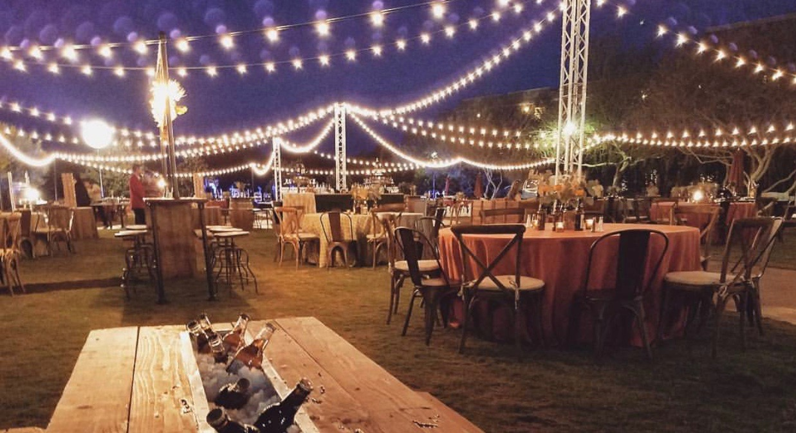

# Scottsdale Events
Modern website for an event company that is built on React. Website features a home page, gallery page, about page, and a services page. 

## Deployment
Visit the application @ {}

## Usages

A website being utilized by ScottsdaleEventsDecor.com to better asssit in client relationships and building buisness by streamlining data and important scheduling information. 

## Meta

Distributed under the ISC license. See ``LICENSE`` for more information.

[https://github.com/tiasirrine/scottsdaleEvents](https://github.com/tiasirrine/)

## Current Contributors

Josh @ [https://github.com/Jhint24](https://github.com/jhint24/)

Tia @ [https://github.com/tiasirrine](https://github.com/tiasirrine/)

Trevor @ [https://github.com/tsjohns9](https://github.com/tsjohns9/)

Wing @ [https://github.com/wingwong82](https://github.com/wingwong82/)
